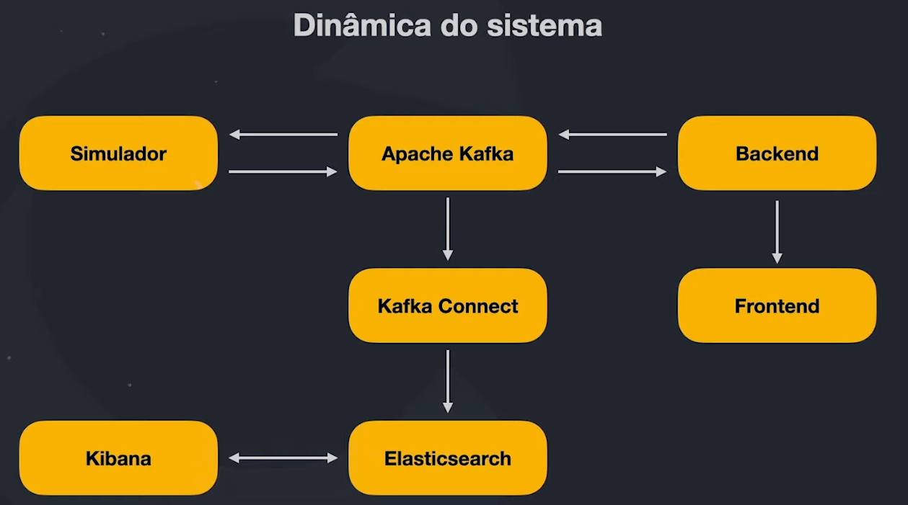

# Code Delivery - Full Cycle Immersion

## :small_orange_diamond:System design diagram

## :rocket: Technologies

- Simulator: Golang
- Backend: Nest.js & MongoDB
- Frontend: React
- Kafka & Kafka Connect
- Elasticsearch & Kibana
- Docker & Kubernetes

### :closed_book: References: [Fullcycle](https://imersao.fullcycle.com.br/evento/)
